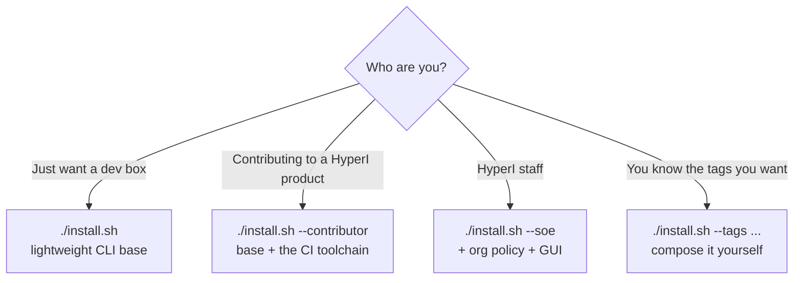

# HyperI Developer Environment

[](https://github.com/hyperi-io/hyperi-developer/releases/latest)
[](https://github.com/hyperi-io/hyperi-developer/releases/latest)
[](LICENSE)
[](#platform-support)
[](https://github.com/hyperi-io/hyperi-developer/commits/main)
[](https://github.com/hyperi-io/hyperi-developer/stargazers)

Standardised modern auto-updating developer environment with opt-in HyperI-specific sections.

Anyone - HyperI staff, contractors, or external developers - can use it as a clean generic dev base, then opt into language-specific tooling (Rust, Python, Go, C, Node, TypeScript), infrastructure-as-code tools, GUI editors, or HyperI's org-specific stack. The default install is lightweight and does not impose HyperI policies on your environment.

## Platform Support

| Platform | Status | Notes |
|----------|--------|-------|
| **Ubuntu 24.04+** | Fully tested | Primary platform |
| **Fedora 43+** | Fully tested | GNOME desktop |
| **macOS** | Fully tested | Homebrew-based |
| **Windows 11** | Productivity host | Hyper-V for Linux VMs |

## Quick Start

```bash
git clone https://github.com/hyperi-io/hyperi-developer
cd hyperi-developer

# Default: lightweight generic CLI dev base (git, docker, shell utilities)
./install.sh

# Opt into more via tags - GUI editors, a language, IaC tools, etc.
./install.sh --tags developer-gui,developer-rust,infrastructure

# Check what would change first (dry run)
./install.sh --check
```

The installer detects your OS and installs the right packages. Nothing
HyperI-specific is installed unless you ask for it. Run `./install.sh --help`
for all options and `./install.sh --list-apps` for every per-app tag.

### Installation Options

Pick your entry point by who you are:



```bash
# Outside contributor working on a HyperI product:
# generic dev base + the toolchain our CI runs, no HyperI org policy
./install.sh --contributor

# HyperI staff workstation: dev base + CI toolchain + org policy + GUI
./install.sh --soe

# Compose tags yourself (GUI editors + Rust + IaC tools):
./install.sh --tags developer-gui,developer-rust,infrastructure

# Just one app:
./install.sh --tags slack
```

### Common Tags

`--list-apps` prints every per-app tag. Some of the common ones:

| Tag | Description |
|-----|-------------|
| `developer` | Generic CLI dev base (the default: git, docker, shell utilities) |
| `developer-gui` | VS Code, Ghostty, DBeaver |
| `developer-rust` / `-go` / `-python` / `-node` / `-typescript` / `-c` | Language toolchains |
| `infrastructure` | OpenTofu, OpenBao, AWS CLI, `k8s` (kubectl, helm, k9s, kind, argocd, kustomize, kubeconform, kube-linter), `data` (clickhouse-client, rpk, valkey-cli, vector) |
| `contributor` | hyperi-ci + its check tools (semgrep, alint), gitleaks, trivy, hadolint, pip-audit, yamllint, ansible-lint, pre-commit, act |
| `soe` / `soe-gui` | HyperI org policy (opt-in) |
| `--full-stack` / `--infra` / `--languages [list]` | Persona bundles (see `--help`) |
| `winlike` / `maclike` | GNOME taskbar (winlike) or dock (maclike), winlike wins if both |
| `rdp-server` | GNOME Remote Desktop on port 3389 (inbound) |
| `rdp-client` | RDP client: Remmina (Linux) / Thincast (macOS) |
| `vpn-clients` | OpenVPN 3, WireGuard, Tunnelblick (macOS) |
| `vm` | VM guest optimisations (QEMU/SPICE agents) |

## What Gets Installed

**Default** (`./install.sh`) - a lightweight generic CLI dev base, nothing HyperI-specific:

- Docker (Engine on Linux, CLI-only via Homebrew on macOS, no Docker Desktop, bring your own daemon)
- Git, GitHub CLI, Git LFS
- CLI utilities: jq, gron, bat, fzf, ripgrep, fd, sd, git-delta, lazygit, moreutils, miller, tmux, htop, age, ...

**Opt-in, via tags:**

- `developer-gui`: VS Code, Ghostty (Solarized theme), DBeaver
- Languages: Rust, Go, Python, C/C++, Node.js, TypeScript (the Astral suite -- uv, ruff, ty -- ships in the base)
- `infrastructure`: OpenTofu + OpenBao (the OSS forks, no HashiCorp BUSL tools), AWS CLI v2. Under `k8s`: kubectl + helm + k9s + kind + argocd + kustomize + dive. The `data` group: clickhouse-client, rpk, valkey-cli, vector
- `contributor`: hyperi-ci and the tools its checks drive (semgrep, alint), gitleaks, trivy, hadolint, pip-audit, ansible-lint, pre-commit, act
- `soe` / `soe-gui`: HyperI org policy: VPN clients, Claude Code, Slack, LibreOffice, RDP client, telemetry-disable, auto-updates, GNOME taskbar

**Desktop UI** (`winlike` or `maclike` tag): GNOME extensions, a transparent taskbar (winlike) or a dock (maclike).

## Requirements

- **Ubuntu 24.04+**, **Fedora 43+**, or **macOS**
- 8GB RAM recommended
- 20GB disk space
- Internet connection

## Project Structure

- `ansible/` - Ansible-based multi-platform installer (Fedora, Ubuntu, macOS)
- `windows/` - Windows 11 SOE setup scripts and documentation
- `tools/` - Developer utilities and helper scripts
  - `tools/git/` - Git-related utilities
- `docs/` - Documentation and guides
- `VERSION` - Version tracking
- `CHANGELOG.md` - Release history

## Developer Utilities

### Git Data Spill Cleanup

The [git-spill-cleanup.sh](tools/git/git-spill-cleanup.sh) utility safely removes sensitive data accidentally committed to git history.

**Use cases:** Remove `.env` files, API keys, passwords, private keys, or any sensitive data from git history.

```bash
# List potentially sensitive files in history
./tools/git/git-spill-cleanup.sh --list

# Remove a specific file from all history
./tools/git/git-spill-cleanup.sh --file .env

# Remove entire directory and all contents
./tools/git/git-spill-cleanup.sh --directory .claude

# Remove all AI assistant artifacts
./tools/git/git-spill-cleanup.sh --ai

# Remove all files matching a pattern
./tools/git/git-spill-cleanup.sh --pattern "*.pem"

# Remove a specific string from all files
./tools/git/git-spill-cleanup.sh --string "sk-abc123secretkey"

# Dry run to preview changes
./tools/git/git-spill-cleanup.sh --file secrets.yml --dry-run
```

**Features:**
- Uses git-filter-repo (modern, GitHub-recommended tool)
- Automatic backups before cleanup (stored in `~/.git-spill-backups/`)
- Remove files, directories, or patterns (wildcards)
- Remove AI assistant artifacts with `--ai` option (Claude, Cursor, Aider, Continue, Copilot, Windsurf, Codeium, Tabnine, etc.)
- String/text removal from all files in history
- Dry-run mode for safe testing
- Friendly install guidance if git-filter-repo is missing
- Comprehensive safety checks and warnings

**Documentation:** See [tools/git/README.md](tools/git/README.md) for detailed usage guide, scenarios, and troubleshooting.

### Git Claude Contributor Fix

The [git-claude-contrib-fix.sh](tools/git/git-claude-contrib-fix.sh) script removes Claude Code from GitHub contributors when it autonomously adds itself without permission.

**Problem:** Claude Code sometimes adds "Co-Authored-By: Claude" attribution to commits without explicit user consent, causing Claude to appear as a repository contributor on GitHub.

**Usage:**

```bash
# Use current repository with default branch
cd hyperi-developer
./tools/git/git-claude-contrib-fix.sh

# Specify repository URL
./tools/git/git-claude-contrib-fix.sh https://github.com/owner/repo.git

# Specify repository and branch
./tools/git/git-claude-contrib-fix.sh https://github.com/owner/repo.git develop
```

**Features:**
- Removes "Co-Authored-By: Claude" and "Generated with Claude Code" from commit messages
- Auto-detects repository default branch (main, master, etc.)
- Optional branch parameter to clean specific branches
- For default branch: forces GitHub contributor reindex
- For non-default branches: only cleans commits (no gh CLI required)
- Comprehensive error handling and automatic cleanup

**Requirements:**
- git (required)
- gh (GitHub CLI) - only required when working on default branch
- Push access to the repository

**Documentation:** See [tools/git/README.md](tools/git/README.md) for detailed usage guide, scenarios, and troubleshooting.

**Help:**
```bash
./tools/git/git-claude-contrib-fix.sh --help
```

## Windows 11 SOE

Automated Windows 11 Standard Operating Environment setup for HyperI developers.

### Overview

Automated Windows 11 configuration for development teams. Installs essential software, enables Hyper-V with full security stack (VBS, Credential Guard, HVCI), removes bloatware, disables telemetry, and configures Australian English locale. Security-first approach using Windows 11's native hypervisor - actual development work happens in Linux VMs while Windows serves as the productivity and VM host platform.

### Quick Start

```powershell
# Run as Administrator in PowerShell
cd windows
.\hyperi-windows.ps1                    # Complete SOE with Hyper-V
.\hyperi-windows.ps1 -SkipVSCode       # Skip VSCode (if running from VSCode)
.\hyperi-windows.ps1 -IncludeM365      # Include Microsoft 365 installation
.\hyperi-windows.ps1 -ShowHelp         # Display detailed help
```

### Software Installation

- **Development Tools** - Git, PowerShell 7, Visual Studio Code, GitHub Desktop, WinMerge
- **Browsers** - Firefox, Chrome (manual default setting required)
- **Office Suite** - Microsoft 365 Business (optional with -IncludeM365)
- **Network Tools** - PuTTY, WinSCP, OpenVPN GUI, TigerVNC
- **Media & Utilities** - VLC, 7-Zip, OBS Studio, Paint.NET, PDFGear
- **Communication** - Slack, Microsoft Teams (with M365)

### System Configuration

- **Privacy** - Telemetry disabled, bloatware removed
- **Regional Settings** - Australian English locale, timezone, date/currency formats
- **Power Management** - Laptop/desktop detection with appropriate settings
- **Desktop** - Clean appearance, no unnecessary shortcuts
- **Custom Wallpaper** - Optional SVG wallpaper support

### Hyper-V Virtualization

- **Native hypervisor** - Uses Windows 11's built-in Hyper-V
- **C:\VM structure** - Automatic directory creation and configuration
- **Default Switch** - Automatic network switch assignment for new VMs
- **Security intact** - All Windows security features remain enabled
- **Linux VM Setup** - See `windows/HYPERV-LINUX.md` for detailed guide

### Security Configuration

- **Virtualization-Based Security (VBS)** - Hardware-backed protection enabled
- **Credential Guard** - Credential isolation via hypervisor
- **HVCI** - Hypervisor-enforced kernel code integrity
- **Core Isolation** - Memory integrity protection
- **Defender ATP** - Optional automated onboarding (drop package in directory)

### Windows Requirements

- **Windows 11 Pro** (24H2 or later recommended, Build 26100+)
- **Administrator privileges**
- **Internet connection**
- **TPM 2.0** (for VBS/Credential Guard)
- **UEFI firmware** (for modern security features)

### Additional Documentation

- **windows/QUICKSTART.md** - Fast setup guide with Hyper-V configuration
- **windows/HYPERV-LINUX.md** - Step-by-step guide for creating Linux VMs in Hyper-V
- **windows/CHANGELOG.md** - Windows SOE version history and release notes

### Why Hyper-V Instead of VMware?

VMware Workstation delivers better Linux VM performance, but requires disabling Windows security features (VBS, Credential Guard, HVCI, Core Isolation). We prioritize security over marginal performance gains. For legacy VMware users, `hyperi-windows-vmware.ps1` exists but is deprecated and unmaintained.

## Contributing

We welcome contributions! Please see [CONTRIBUTING.md](CONTRIBUTING.md) for:
- How to submit pull requests
- Code standards and style guidelines
- Testing requirements
- Development workflow

## License

Apache License 2.0 - See [LICENSE](LICENSE) file for details.
