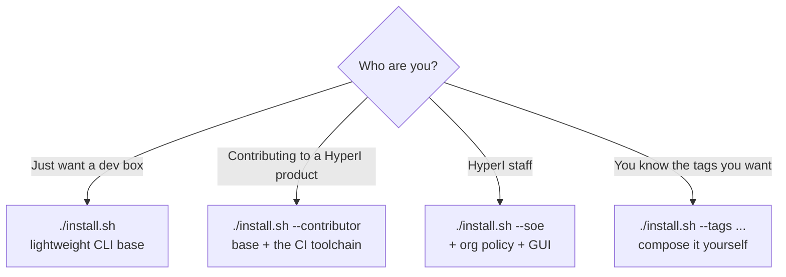

# HyperI Developer Environment

[](https://github.com/hyperi-io/hyperi-developer/releases/latest)
[](https://github.com/hyperi-io/hyperi-developer/releases/latest)
[](LICENSE)
[](#platform-support)
[](https://github.com/hyperi-io/hyperi-developer/commits/main)
[](https://github.com/hyperi-io/hyperi-developer/stargazers)

Standardised modern auto-updating developer environment with opt-in HyperI-specific sections.

Anyone - HyperI staff, contractors, or external developers - can use it as a clean generic dev base, then opt into language-specific tooling (Rust, Python, Go, C, Node, TypeScript), infrastructure-as-code tools, GUI editors, or HyperI's org-specific stack. The default install is lightweight and does not impose HyperI policies on your environment.

## Platform Support

| Platform | Status | Notes |
|----------|--------|-------|
| **Ubuntu 24.04+** | Fully tested | Primary platform |
| **Fedora 43+** | Fully tested | GNOME desktop |
| **macOS** | Fully tested | Homebrew-based |
| **Windows 11** | Productivity host | Hyper-V for Linux VMs |

## Quick Start

```bash
git clone https://github.com/hyperi-io/hyperi-developer
cd hyperi-developer

# Default: lightweight generic CLI dev base (git, docker, shell utilities)
./install.sh

# Opt into more via tags - GUI editors, a language, IaC tools, etc.
./install.sh --tags developer-gui,developer-rust,infrastructure

# Check what would change first (dry run)
./install.sh --check
```

The installer detects your OS and installs the right packages. Nothing
HyperI-specific is installed unless you ask for it. Run `./install.sh --help`
for all options and `./install.sh --list-apps` for every per-app tag.

### Installation Options

Pick your entry point by who you are:


```mermaid
flowchart TD
    q{Who are you?}
    q -->|Just want a dev box| base["./install.sh<br/>lightweight CLI base"]
    q -->|Contributing to a HyperI product| contrib["./install.sh --contributor<br/>base + the CI toolchain"]
    q -->|HyperI staff| soe["./install.sh --soe<br/>+ org policy + GUI"]
    q -->|You know the tags you want| tags["./install.sh --tags ...<br/>compose it yourself"]
```

```bash
# Outside contributor working on a HyperI product:
# generic dev base + the toolchain our CI runs, no HyperI org policy
./install.sh --contributor

# HyperI staff workstation: dev base + CI toolchain + org policy + GUI
./install.sh --soe

# Compose tags yourself (GUI editors + Rust + IaC tools):
./install.sh --tags developer-gui,developer-rust,infrastructure

# Just one app:
./install.sh --tags slack
```

### Common Tags

`--list-apps` prints every per-app tag. Some of the common ones:

| Tag | Description |
|-----|-------------|
| `developer` | Generic CLI dev base (the default: git, docker, shell utilities) |
| `developer-gui` | VS Code, Ghostty, DBeaver. Privacy + AI-upsell de-nag profile for VSCode/VSCodium/Cursor off unless `-e vscode_privacy_enabled=true` |
| `developer-rust` / `-go` / `-python` / `-node` / `-typescript` / `-c` | Language toolchains |
| `infrastructure` | OpenTofu, OpenBao, AWS CLI, helm, terraform-docs, `k8s` (kubectl, kubectx, kubens, k9s, kind, argocd, dive, kustomize, kubeconform, kube-linter), `data` (clickhouse-client, rpk, valkey-cli, vector), `cloudflare` (flarectl, wrangler) |
| `contributor` | hyperi-ci + its check tools (semgrep, alint), gitleaks, trivy, hadolint, pip-audit, yamllint, ansible-lint, pre-commit, act, git-scrub, macbash |
| `soe` / `soe-gui` | HyperI org policy (opt-in) |
| `--full-stack` / `--infra` / `--languages [list]` | Persona bundles (see `--help`) |
| `winlike` / `maclike` | GNOME taskbar (winlike) or dock (maclike), winlike wins if both |
| `rdp-server` | GNOME Remote Login on port 3389 (inbound). NOT Desktop Sharing -- see the note below the table |
| `rdp-client` | RDP client: Remmina (Linux) / Thincast (macOS) |
| `vpn-clients` | OpenVPN 3, WireGuard, Tunnelblick (macOS) |
| `vm` | VM guest optimisations (QEMU/SPICE agents) |
| `power-profile` | Sleep/idle/lid policy. `always-on` (default) or `vm`, via `-e power_profile=<name>` |
| `zram` | Compressed-RAM swap so cgroup memory limits throttle instead of stalling. Pairs with the Rust build governor |
| `arcane` | Arcane container UI, localhost-only. Off unless `-e soe_arcane_enabled=true`. Add `-e soe_arcane_long_session=true` for a year-long login |
| `local-services` | Persistent local ClickHouse + Redpanda for spikes. Off unless `-e soe_local_services_enabled=true` |

### Remote Login is not Desktop Sharing

GNOME ships two different remote-access features out of the one
`gnome-remote-desktop` package, and Settings puts them on separate tabs.
`rdp-server` configures **Remote Login** only:

| | Remote Login | Desktop Sharing |
|---|---|---|
| Scope | System-wide, serves the GDM greeter | One user's running session |
| Managed with | `grdctl --system` | `grdctl` (no `--system`) |
| Credentials live in | `/var/lib/gnome-remote-desktop/` | that user's keyring |
| Settings tab | System > Remote Login | System > Desktop Sharing |

The role never touches Desktop Sharing. It also **never overwrites credentials
GNOME already holds** -- it mints a password only when Remote Login has none, so
re-running it cannot lock out whoever is already connecting. To rotate
deliberately, delete `/etc/hyperi/rdp-credentials` and re-run.

### Which users get the user-level settings

Most of what this installs is system-wide, but some of it is per-user: shell
config, `~/.cargo`, `~/.local/bin`, dconf/GNOME settings, the Arcane and
local-services stacks.

`./install.sh` applies those for **every account a person actually works in**.
Three kinds are skipped:

- `root`
- system accounts -- uid below 1000, the systemd range above 60000, and
  anything shelled to `nologin`/`false`/`sync`
- **the cloud image's own account** -- `ubuntu` on an Ubuntu cloud image,
  `cloud-user` on a Red Hat one. It exists to provision the machine, not to
  work in, so it gets the system-wide setup and none of the dotfiles

That last one is read from `system_info.default_user.name` in
`/etc/cloud/cloud.cfg`, which is where cloud-init declares it, rather than
matching on the name.

Name any set yourself when that is not what you want -- including the cloud
account:

```bash
./install.sh --users hyperi,ubuntu
```

**If no account qualifies, nothing is applied and the run stops** with the
reason. That happens on a machine holding only `root`, system accounts and the
image's own -- a fresh cloud image, typically. It does not guess: writing
dotfiles into `root` or the provisioning account is the outcome the criteria
exist to prevent, so name the account you meant with `--users`.

Each user gets their own pass. The system-wide work is idempotent, so it
happens once in effect and later passes no-op; one user's settings never
overwrite another's.

Driving Ansible directly instead of `install.sh`? It takes one user per run, so
loop it:

```bash
for u in ubuntu hyperi; do
    ansible-playbook ... -e hyperi_target_user="$u"
done
```

That matters most on a fleet machine reached over SSH as a service account,
because that account's home is not the desktop. Get it wrong and the run still
reports success -- the settings simply land where nobody sees them.

Settings that are true of one machine rather than of the repo -- a dedicated
cache volume, say -- go in `local-config/vars.yml` at the repo root, which is
gitignored and loaded on every run, tagged or not. A setting passed once as
`-e` and never written down is lost at the next converge: a box with a 512G
cache volume had its Rust build pool silently moved onto the root filesystem
that way. Anything in that file runs with the playbook's own authority -- root,
under `become` -- so treat it exactly as you would the playbook.

## What Gets Installed

The summary below is the shape of it. [docs/install-matrix.md](docs/install-matrix.md)
is the single source of truth for the detail: every role, group, persona and
tool, which tag selects it, how each one is fetched, and which of them verify a
digest. Read that before changing a role or adding a tool.

**Default** (`./install.sh`) - a lightweight generic CLI dev base, nothing HyperI-specific:

- Docker (Engine on Linux, CLI-only via Homebrew on macOS, no Docker Desktop, bring your own daemon)
- Git, GitHub CLI, Git LFS
- CLI utilities: jq, gron, bat, fzf, ripgrep, fd, sd, git-delta, lazygit, moreutils, miller, tmux, htop, age, ...

**Opt-in, via tags:**

- `developer-gui`: VS Code, Ghostty (Solarized theme), DBeaver
- `vscode-privacy` (off by default): strips the Copilot/AI upsell UI and the telemetry that stock VSCode ships enabled, across VSCode, VSCodium and Cursor. Enable with `-e vscode_privacy_enabled=true`. It merges one marked block into `settings.json` and never touches a comment or a key it does not manage, backs the file up before its first write, and `-e vscode_privacy_uninstall=true` takes only its own keys back out. Where you have set one of those keys yourself further down the file, yours wins and the run tells you which ones -- so it cannot look applied while changing nothing
- Languages: Rust, Go, Python, C/C++, Node.js, TypeScript (the Astral suite -- uv, ruff, ty -- ships in the base, as does Node.js: it is core tooling that semantic-release and CI need)
- `infrastructure`: OpenTofu + OpenBao (the OSS forks, no HashiCorp BUSL tools), AWS CLI v2, checkov, and terraform-docs for generating IaC module reference docs (engine-agnostic -- it reads `.tf` whichever binary runs it, and OpenTofu has no native `tofu docs`). Under `k8s`: kubectl + kubectx + kubens + k9s + kind + argocd + dive + kustomize + kubeconform + kube-linter. helm is NOT in that group -- it sits in `cloud`, so plain `--tags infrastructure` gets it whether or not you select `k8s`. The `data` group: clickhouse-client, rpk, valkey-cli, vector. The `cloudflare` group: flarectl + wrangler (flarectl builds from source on both platforms -- Cloudflare ships no binary -- so Linux needs `developer-go`)
- `contributor`: hyperi-ci and the tools its checks drive (semgrep, alint), gitleaks, trivy, hadolint, pip-audit, ansible-lint, pre-commit, act, and git-scrub for rewriting AI residue or a leaked secret out of git history -- gitleaks scans FULL history, so a secret removed from HEAD still fails the gate. macbash is here too: it flags the GNU-only bash constructs that break on macOS, and CONTRIBUTING.md asks for it on every shell change
- `soe` / `soe-gui`: HyperI org policy: VPN clients, Claude Code, Slack, LibreOffice, RDP client, telemetry-disable, auto-updates, GNOME taskbar
- `developer-ai` (off by default): the OpenAI Codex CLI as a second opinion alongside Claude Code rather than a replacement for it, plus OpenAI's Codex plugin FOR Claude Code, so `/codex:review` and `/codex:adversarial-review` are things Claude asks Codex for. The plugin is skipped -- with a warning naming the tag that fixes it -- unless claude, codex and a new enough node are all present for that user, because it installs happily without them and then throws on every invocation. Sign-in stays the person's: `codex login --device-auth` on a box with no browser
- `power-profile` (off by default, and deliberately not in `soe`): sleep, idle and lid policy, selected per machine. `always-on` (the default profile) never idle-suspends on mains power and does not sleep when the lid shuts -- for a repurposed laptop doing build work, or a desktop that has to answer ssh. `vm` never sleeps or suspends at all, for an unattended RDP guest that nobody can walk over and wake. Battery behaviour stays stock under `always-on`, because a machine that will not sleep in a bag cooks itself. Profiles are data files, so adding one is adding a file -- see [roles/power-profile/README.md](ansible/roles/power-profile/README.md)
- `zram` (off by default, and deliberately not in `soe`): a small compressed-RAM swap device, sized from the host's RAM and capped at 8 GiB. It exists because cgroup `MemoryHigh` throttles by reclaim, and on a swapless host the only reclaimable memory is page cache -- so a build past its budget stalls rather than slows. Pairs with the Rust build governor, which warns at converge time when it lands on a swapless host. Never restarts a running device, so a size change waits for a reboot -- see [roles/zram_swap/README.md](ansible/roles/zram_swap/README.md)
- `arcane` (off by default): [Arcane](https://getarcane.app), a web UI for the containers on the box. Enable it with `-e soe_arcane_enabled=true` and you get a daemon on `http://localhost:3552` that comes back after a reboot and keeps itself updated. Works against docker-ce on Linux and colima on macOS. Bound to loopback because it holds the Docker socket, so whatever reaches that port owns the machine. Login is whatever Arcane seeds -- `arcane` / `arcane-admin` as upstream documents it. The role sets neither, and only clears the forced first-login password prompt, which it does by re-submitting that seeded password so the credentials stay unchanged. That needs the password policy relaxed to `basic` (`soe_arcane_password_policy`), because upstream's default `strong` policy rejects its own seeded password. There is still a login -- auto-login sits behind a `buildables` Go build tag that no published image is compiled with, so zero-auth is not available without building your own image. The login lasts about a day by default, which is a prompt every morning on a dev box -- `-e soe_arcane_long_session=true` stretches it to a year from each login. It is off by default because Arcane holds the Docker socket, and it takes one log-out and log-in to take effect, since the session expiry is stamped at login
- `local-services` (off by default): a persistent local ClickHouse and Redpanda for ad-hoc work -- somewhere to poke at a query or hand-feed a topic without waiting for a suite to build. Enable with `-e soe_local_services_enabled=true`. Deployed **stopped**: `restart: no`, so a reboot leaves them down and they cost nothing until `local-services up`, which pulls latest and takes seconds. Both capped at 1GB and bound to loopback. They are spike instances -- integration and e2e suites create and tear down their own containers, because a shared daemon makes a suite non-hermetic and order-dependent

**Desktop UI** (`winlike` or `maclike` tag): GNOME extensions, a transparent taskbar (winlike) or a dock (maclike).

## Requirements

- **Ubuntu 24.04+**, **Fedora 43+**, or **macOS**
- 8GB RAM recommended
- 20GB disk space
- Internet connection

## Project Structure

- `ansible/` - Ansible-based multi-platform installer (Fedora, Ubuntu, macOS)
- `windows/` - Windows 11 SOE setup scripts and documentation
- `tools/` - Developer utilities and helper scripts
  - `tools/git/` - Git-related utilities
- `docs/` - Documentation and guides
- `VERSION` - Version tracking
- `CHANGELOG.md` - Release history

## Developer Utilities

### Git Data Spill Cleanup

The [git-spill-cleanup.sh](tools/git/git-spill-cleanup.sh) utility safely removes sensitive data accidentally committed to git history.

**Use cases:** Remove `.env` files, API keys, passwords, private keys, or any sensitive data from git history.

```bash
# List potentially sensitive files in history
./tools/git/git-spill-cleanup.sh --list

# Remove a specific file from all history
./tools/git/git-spill-cleanup.sh --file .env

# Remove entire directory and all contents
./tools/git/git-spill-cleanup.sh --directory .claude

# Remove all AI assistant artifacts
./tools/git/git-spill-cleanup.sh --ai

# Remove all files matching a pattern
./tools/git/git-spill-cleanup.sh --pattern "*.pem"

# Remove a specific string from all files
./tools/git/git-spill-cleanup.sh --string "sk-abc123secretkey"

# Dry run to preview changes
./tools/git/git-spill-cleanup.sh --file secrets.yml --dry-run
```

**Features:**
- Uses git-filter-repo (modern, GitHub-recommended tool)
- Automatic backups before cleanup (stored in `~/.git-spill-backups/`)
- Remove files, directories, or patterns (wildcards)
- Remove AI assistant artifacts with `--ai` option (Claude, Cursor, Aider, Continue, Copilot, Windsurf, Codeium, Tabnine, etc.)
- String/text removal from all files in history
- Dry-run mode for safe testing
- Friendly install guidance if git-filter-repo is missing
- Comprehensive safety checks and warnings

**Documentation:** See [tools/git/README.md](tools/git/README.md) for detailed usage guide, scenarios, and troubleshooting.

### Git Claude Contributor Fix

The [git-claude-contrib-fix.sh](tools/git/git-claude-contrib-fix.sh) script removes Claude Code from GitHub contributors when it autonomously adds itself without permission.

**Problem:** Claude Code sometimes adds "Co-Authored-By: Claude" attribution to commits without explicit user consent, causing Claude to appear as a repository contributor on GitHub.

**Usage:**

```bash
# Use current repository with default branch
cd hyperi-developer
./tools/git/git-claude-contrib-fix.sh

# Specify repository URL
./tools/git/git-claude-contrib-fix.sh https://github.com/owner/repo.git

# Specify repository and branch
./tools/git/git-claude-contrib-fix.sh https://github.com/owner/repo.git develop
```

**Features:**
- Removes "Co-Authored-By: Claude" and "Generated with Claude Code" from commit messages
- Auto-detects repository default branch (main, master, etc.)
- Optional branch parameter to clean specific branches
- For default branch: forces GitHub contributor reindex
- For non-default branches: only cleans commits (no gh CLI required)
- Comprehensive error handling and automatic cleanup

**Requirements:**
- git (required)
- gh (GitHub CLI) - only required when working on default branch
- Push access to the repository

**Documentation:** See [tools/git/README.md](tools/git/README.md) for detailed usage guide, scenarios, and troubleshooting.

**Help:**
```bash
./tools/git/git-claude-contrib-fix.sh --help
```

### Host Drift Check

[hyperi-doctor](tools/hyperi-doctor) answers "has this host fallen behind the SOE?" without applying anything and without sudo.

```bash
./tools/hyperi-doctor                             # scope from the applied-state stamp, or 'developer'
./tools/hyperi-doctor --tags developer-rust,soe   # explicit role scope
./tools/hyperi-doctor --quiet                     # problems only, exit code as a gate
```

It reports the applied-state stamp's age and git SHA against this checkout, and which declared apt/dnf/homebrew packages are actually missing. Package names built from a loop, a variable or Jinja cannot be resolved by a static scan, and it prints that count rather than implying a clean result.

**Documentation:** See [tools/README.md](tools/README.md).

## Windows 11 SOE

Automated Windows 11 Standard Operating Environment setup for HyperI developers.

### Overview

Automated Windows 11 configuration for development teams. Installs essential software, enables Hyper-V with full security stack (VBS, Credential Guard, HVCI), removes bloatware, disables telemetry, and configures Australian English locale. Security-first approach using Windows 11's native hypervisor - actual development work happens in Linux VMs while Windows serves as the productivity and VM host platform.

### Quick Start

```powershell
# Run as Administrator in PowerShell
cd windows
.\hyperi-windows.ps1                    # Complete SOE with Hyper-V
.\hyperi-windows.ps1 -SkipVSCode       # Skip VSCode (if running from VSCode)
.\hyperi-windows.ps1 -IncludeM365      # Include Microsoft 365 installation
.\hyperi-windows.ps1 -ShowHelp         # Display detailed help
```

### Software Installation

- **Development Tools** - Git, PowerShell 7, Visual Studio Code, GitHub Desktop, WinMerge
- **Browsers** - Firefox, Chrome (manual default setting required)
- **Office Suite** - Microsoft 365 Business (optional with -IncludeM365)
- **Network Tools** - PuTTY, WinSCP, OpenVPN GUI, TigerVNC
- **Media & Utilities** - VLC, 7-Zip, OBS Studio, Paint.NET, PDFGear
- **Communication** - Slack, Microsoft Teams (with M365)

### System Configuration

- **Privacy** - Telemetry disabled, bloatware removed
- **Regional Settings** - Australian English locale, timezone, date/currency formats
- **Power Management** - Laptop/desktop detection with appropriate settings
- **Desktop** - Clean appearance, no unnecessary shortcuts
- **Custom Wallpaper** - Optional SVG wallpaper support

### Hyper-V Virtualization

- **Native hypervisor** - Uses Windows 11's built-in Hyper-V
- **C:\VM structure** - Automatic directory creation and configuration
- **Default Switch** - Automatic network switch assignment for new VMs
- **Security intact** - All Windows security features remain enabled
- **Linux VM Setup** - See `windows/HYPERV-LINUX.md` for detailed guide

### Security Configuration

- **Virtualization-Based Security (VBS)** - Hardware-backed protection enabled
- **Credential Guard** - Credential isolation via hypervisor
- **HVCI** - Hypervisor-enforced kernel code integrity
- **Core Isolation** - Memory integrity protection
- **Defender ATP** - Optional automated onboarding (drop package in directory)

### Windows Requirements

- **Windows 11 Pro** (24H2 or later recommended, Build 26100+)
- **Administrator privileges**
- **Internet connection**
- **TPM 2.0** (for VBS/Credential Guard)
- **UEFI firmware** (for modern security features)

### Additional Documentation

- **windows/QUICKSTART.md** - Fast setup guide with Hyper-V configuration
- **windows/HYPERV-LINUX.md** - Step-by-step guide for creating Linux VMs in Hyper-V
- **windows/CHANGELOG.md** - Windows SOE version history and release notes

### Why Hyper-V Instead of VMware?

VMware Workstation delivers better Linux VM performance, but requires disabling Windows security features (VBS, Credential Guard, HVCI, Core Isolation). We prioritize security over marginal performance gains. For legacy VMware users, `hyperi-windows-vmware.ps1` exists but is deprecated and unmaintained.

## Contributing

We welcome contributions! Please see [CONTRIBUTING.md](CONTRIBUTING.md) for:
- How to submit pull requests
- Code standards and style guidelines
- Testing requirements
- Development workflow

## License

Apache License 2.0 - See [LICENSE](LICENSE) file for details.
