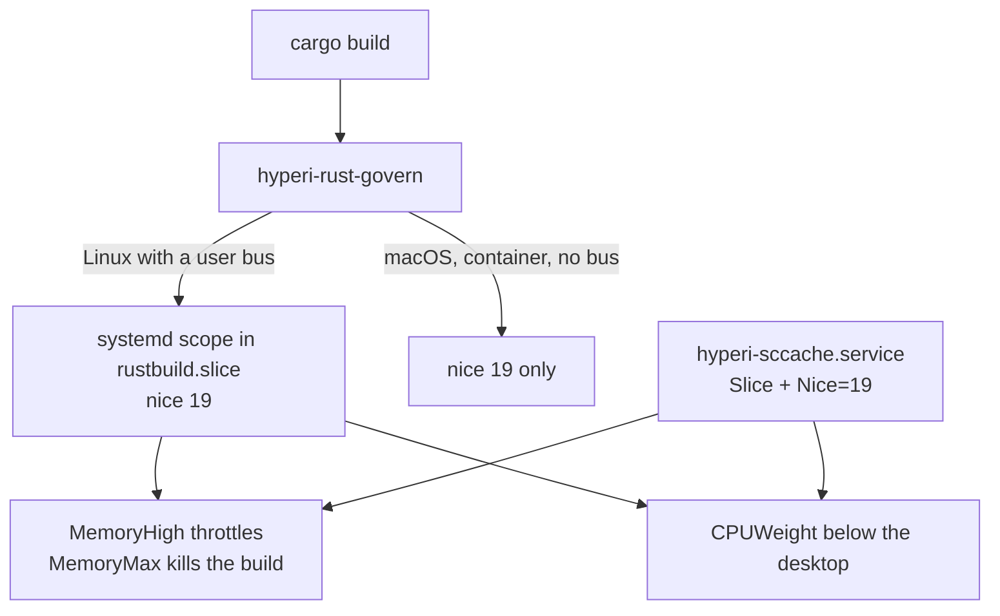

# Many build sessions on one host

Rust builds are bounded by a memory budget on a systemd slice, the pooled build
artefacts by a ceiling derived from the disk, and the compiler caches by fixed
byte ceilings.
Nothing beyond those three is bounded here at all. This is what each means, and
where the edges are.

## The bound that matters is memory per build, not builds per queue

A workstation runs up to a dozen editor and agent sessions, typically four, each
able to start a heavy build. The host should be used fully, no session should
starve another, and none should starve the desktop. Four constraints shape the
answer.

- **Cache location is a variable.** Most hosts have no dedicated cache volume, so
  the platform cache directory is the default and an alternate path is opt-in.
- **Never run a volume to 100%**, checked as work proceeds rather than only on a
  schedule.
- **No tool owns the disk.** Rust, Docker and C++ share one volume, so
  pre-allocating is wrong.
- **The tools stay independent.** Each keeps itself in bounds without knowing the
  others exist.

**Memory is spent per crate, not per job.** One enormous crate compiles as a
single `rustc` however high `-j` goes, so the job count sets how many *crates*
build at once while the largest crate sets a floor no job setting goes under. On
a 32-core workstation with 246 GB RAM the peak resident size of one `rustc` was
11.6 GB. That is why the bound is a memory budget on the whole build tree and
not a policy about job counts: a job count cannot bound what one process costs.

Someone arriving cold with a new project gets the whole mechanism with no opt-in,
which is why it is a shim on PATH rather than a setting to remember.

## The governor bounds memory and defers CPU, and rations neither

`hyperi-rust-govern` is installed as `~/.local/bin/cargo`, ahead of the real
cargo. Every build runs at nice 19, and on Linux with a live user manager it also
runs in `rustbuild.slice`, whose memory budget is a percentage of the host's own
RAM and whose CPU weight sits below the desktop's. Where there is no live user
manager the shim falls back to `nice` alone, with no memory bound behind it.

Nothing withholds cores and nothing sets a job count - cargo's own default is
already every core. A reserve or a computed `-j` is paid on an idle machine as
well as a busy one, and buys nothing that yielding does not buy when it is
needed. The semaphore this replaced did both, built at `-j3` on a 32-core box,
and was shared state two sessions could disagree about. With nothing computed
there is nothing to keep in sync.

Which instrument makes a build yield on which host, and why `CPUWeight` rather
than nice is the Linux one, are in
[rust-build-governor.md](rust-build-governor.md).

## The toolchain location is read from the host, never assumed

`rust_cargo_home` and `rust_rustup_home` are empty by default, meaning the role
probes the target user's own login shell for `CARGO_HOME` and `RUSTUP_HOME` and
falls back to `~/.cargo` and `~/.rustup` - which is what cargo and rustup do
themselves. An explicit role variable beats the probe.

Hard-coding `~/.cargo` fails silently on a host that relocates `CARGO_HOME`: a
correct `config.toml` is written to a directory cargo never reads, whatever stale
file sits at the real location stays in effect, and the converge reports success
while every build fails. Three things close that off, the first two on by default
and each with a variable to disable it.

- A **fatal post-condition** at the end of the toolchain run: the converge fails
  when a cargo config names a `rustc-wrapper` that does not resolve
  (`rust_verify_wrapper`). Both candidate config locations are checked, so a
  wrong probe cannot self-certify.
- A config left behind in the old location is **renamed, not deleted**
  (`rust_retire_superseded_config`). It is inert while the relocation holds and
  live the moment it does not.
- Shell profile entries write `${CARGO_HOME:-$HOME/.cargo}/bin` rather than a
  resolved path, so they stay correct if the toolchain moves without a converge.

## The pool gets a derived ceiling, and free space is the backstop

Pooled build artefacts have a ceiling of their own, derived from the filesystem
rather than fixed. `rust_cache_build_dir_max: auto` is a sixth of the
filesystem's total size with a 40G floor, so one default suits a laptop and a
build box. A daily unit prunes to that ceiling - by age first at 14 days, then
oldest by build time until under it - and an hourly guard runs the same prune
gated on `rust_cache_prune_free_floor` (20%), costing one `statvfs` and exiting
before walking anything while the disk has room.

A share works here because it is one tool, one pool, and a ceiling that scales
with the disk. What does not compose is every suite claiming one: "a sixth of the
filesystem, floor 40G" adopted across Rust, Docker, Go, C++ and Python reserves
200G in floors alone before anything is cached, and every tool stays
independently correct while the disk fills. So the cross-tool mechanism would be
a shared free-space floor and nothing else - no declared shares, no new role.
journald already works this way, with a `SystemKeepFree` reserve of 15% capped
at 4G.

Two properties of the pruner let it compose with tools it knows nothing about.
Unless a pool is named explicitly on the command line, it refuses to prune one
outside the cache root, so a mis-set `build-dir` cannot walk a home directory.
And a guarded run that finds the pool already inside its ceiling says so and
stops rather than hunting for more to delete - the space went somewhere it does
not own, and naming that is more use than evicting artefacts that were not the
cause.

`rust_cache_root` selects the volume, empty meaning the platform cache directory.
A host-specific value needs somewhere to live: passed on a command line it is
lost at the next converge, which is the same failure as a cargo config written
where nothing reads it. The playbook loads `local-config/vars.yml` when it
exists, tagged `always` so a tagged run picks it up too.

## zram is what makes the memory budget throttle instead of stall

`MemoryHigh` throttles by reclaim rather than refusing an allocation. On a host
with no swap the only reclaimable memory is page cache, so once a build's
anonymous memory passes the line there is nothing left to reclaim and the
throttle stops being a slowdown and becomes a stall. zram makes anonymous pages
reclaimable by compressing them in place. It is not extra capacity and not a swap
tier - it is somewhere for the throttle to push, which is why a few GB is the
right size and a disk-backed swap file is not a substitute.

The `zram_swap` role is opt-in on `--tags zram` and sizes the device at
`min(ram / 8, 8192)` MiB. It raises `vm.swappiness` to 180, because reclaiming a
compressed anonymous page costs a memcpy rather than a disk seek, and it leaves
swappiness alone on a host that already has non-zram swap active, where 180 would
push anonymous pages onto a disk. The governor warns at converge time when it
lands on a swapless host.

**It never restarts a running swap device.** Applying a new size means `swapoff`,
which pages every byte held in the device back into RAM, and doing that to a host
already under memory pressure is how a config change OOMs a build box. A changed
size is written to the config and takes effect at the next reboot.

## The measured sccache win does not survive its own context

sccache refuses to cache any `rustc` call carrying `-C incremental`, and the dev
and test profiles enable it by default. Measured on a large multi-crate workspace
with `CARGO_INCREMENTAL=0`: a warm rebuild made 1397 compile requests and
returned a 94.73% Rust hit rate, which sccache computes over the Rust
compilations it served; a cold rebuild of the same workspace made 743 requests at
0.00%, because every prior build on that host had been incremental so the store
held no Rust entries at all.

**That is not an argument for turning incremental off, and
`rust_governor_no_incremental` defaults false.** The warm run was a full-workspace
rebuild dominated by dependencies, and cargo never builds dependencies
incrementally - most of what it measured was caching that already worked. What
the setting buys is caching of *workspace* crates, paid for by losing incremental
on those same crates.

The switch works in both directions per invocation:
`HYPERI_RUST_GOVERN_NO_INCREMENTAL=1` turns it on where the role left it off, and
`=0` opts out on a host where the role turned it on. Setting `CARGO_INCREMENTAL=1`
is not an opt-out - sccache refuses the build outright rather than falling back
to compiling. Which hosts want it on is in
[rust-build-governor.md](rust-build-governor.md).

## What is capped elsewhere, and what is not capped at all

- **sccache and ccache are capped, but not by the watermark.**
  `rust_cache_sccache_max` (20G) and `rust_cache_ccache_max` (10G) are fixed byte
  ceilings the tools enforce for themselves, so they sit outside the free-space
  model and the pruner reports them rather than touching them.
- **Docker, Go and Python have nothing here.** No cache-root variable and no
  watermark pruning. The free-space decision applies to them; the implementation
  is not built.
- **There is no universal ceiling for ungoverned tools.** The shim is kept for
  Rust. systemd prefix drop-ins on the scopes a desktop session already creates
  would cap everything else without a shim per tool, and are not built. Docker is
  out of reach of any session mechanism regardless, because `dockerd` is a child
  of PID 1 and container processes are created under its tree: its levers are
  `cgroup-parent` in `daemon.json`, the per-container flag of the same name, and
  compose's `cgroup_parent`.
- **Builds are not queued.** Several started at once all run at every core and
  share the slice's memory budget, so on a small-RAM host one may be killed at
  `MemoryMax` rather than wait its turn: a failed build, retried, not a failed
  host.
- **Nothing bounds memory where there is no user bus.** A container or a
  degraded session gets nice 19 and nothing else.
- **Disk priority is untouched.** `ionice` binds only under BFQ, and NVMe hosts
  run `none` or `mq-deadline`, where it does nothing.
