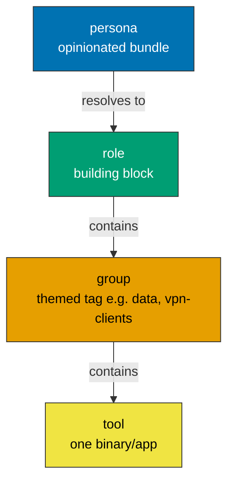
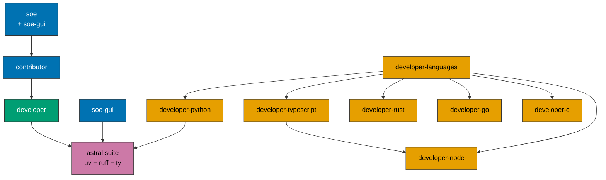

# Install matrix - roles, groups, personas, tools

Single source of truth for WHAT installs, HOW you select it, and HOW each tool
is fetched. Read this before changing a role, adding a tool, or wiring a new
persona.

## Bottom line

Four levels, smallest to largest: **tool -> group -> role -> persona.** Every
level is selectable the same way from Ansible and from `install.sh`
(`--tags <name>`). The bare `./install.sh` runs only the additive `developer`
base; everything else is opt-in. Two fetch modes: **latest** (default, no
maintenance) and **`--pinned`** (opt-in: exact versions mirroring hyperi-ci).

Snipe any level directly: `--tags ripgrep` (tool), `--tags data` (group),
`--tags infrastructure` (role), `--tags full-stack` (persona). Everything is
additive, so levels combine: `--soe --languages rust,go`.

## Personas - the opinionated bundles

A persona is a meta-role: it carries no tasks, only `meta/dependencies`, so it
resolves identically in Ansible and the CLI. Pick one, or none (the default).

| Persona | Flag | Pulls in | For |
|---|---|---|---|
| default | (none) | `developer` base only | anyone - a clean, additive CLI base |
| languages | `--languages [langs]` | all toolchains, or a subset - `--languages rust,go` | polyglot dev box |
| full-stack | `--full-stack` | developer + gui + node + typescript + python + infrastructure | app dev, front-to-back |
| infra | `--infra` | developer + infrastructure | SRE / platform |
| contributor | `--contributor` | developer + contributor (CI toolchain) | outside contributor to a HyperI product |
| soe | `--soe` | developer + contributor + soe + soe-gui | HyperI staff workstation |

**Everything combines.** Personas, roles, groups and tools are additive tags, so
you mix them freely: `--soe --languages rust,go`, `--full-stack --tags infrastructure`,
`--infra --tags vscode`. `--languages` takes an optional comma list for a subset
(`--languages rust,go`) or, bare, pulls every toolchain.

**Persona wiring caveat.** `--tags developer` OVERRIDES the `never` gate (the
role tag sits on every base task), so a persona must resolve through its own
meta-role tag, never by passing the raw `developer` tag - otherwise it drags in
`chrome`/`removals`/etc. The default no-tags run is unaffected and stays
additive.

## Roles and their dependency nesting

Roles are the building blocks. The meta-dependency chain means selecting a
higher role pulls the lower ones automatically - nobody memorises the list.

| Role | Tag | Deps | Opt-in |
|---|---|---|---|
| developer | `developer` | astral | default (runs bare) |
| developer-gui | `developer-gui` | - | opt-in |
| developer-rust / -go / -node / -c | same | (node: -) | opt-in |
| developer-python | `developer-python` | astral | opt-in |
| developer-typescript | `developer-typescript` | developer-node | opt-in |
| developer-languages | `developer-languages` | all `developer-<lang>` | opt-in (meta) |
| infrastructure | `infrastructure` | - | opt-in |
| contributor | `contributor` | developer | opt-in |
| soe | `soe` | contributor | opt-in |
| soe-gui | `soe-gui` | astral | opt-in |
| rdp-server | `rdp-server` | - | opt-in |
| rdp-client | `rdp-client` | - | opt-in / soe default |
| vpn-clients | `vpn-clients` | - | opt-in / soe default |
| astral (uv + ruff + ty) | `astral` | - | base component; also dep of python/soe-gui |
| bash-modern | `bash-modern` | - | opt-in (macOS) |
| vm_optimizer | `vm` | - | opt-in |
| system_cleanup | `always` | - | always (cache-clean only) |

## Groups - themed tag bundles inside a role

A group is a themed tag over several tools in one role, so you can take the set
without the whole role.

| Group | Tag | Role | Tools |
|---|---|---|---|
| data | `data` | infrastructure | clickhouse-client, rpk, valkey-cli, vector |
| forgejo | `forgejo` / `codeberg` | soe | tea (Forgejo/Gitea CLI) |
| rdp-client | `rdp-client` | rdp-client | Remmina (Linux), Thincast (macOS) |
| vpn-clients | `vpn-clients` | vpn-clients | OpenVPN 3, WireGuard, Tunnelblick (macOS) |

Per-app tags stay too (`--tags vscode`, `--tags slack`, ...): run
`./install.sh --list-apps` for the full per-app list.

## Tool matrix - install method and pin policy per tool

`Method` is how the tool is fetched. **Default installs are always latest and
unpinned** - the `Pinned` column applies ONLY when you opt into `--pinned`, and
then says what that mode does: **SHA256** = manual binary, pin the version and
verify a checksum; **version** = repo/brew-signed, pin the version only; **n/a**
= not pinnable/meta. Only the manual-binary (SHA256) rows carry supply-chain risk
that a checksum closes.

### developer (base, additive - runs bare)

| Tool(s) | Platforms | Method | Pinned |
|---|---|---|---|
| astral suite: uv, ruff, ty (uv bundles `uv audit` + `uv check`) | all | Fedora dnf / macOS brew; Ubuntu has no apt package (see Auto-update) | version / SHA256 |
| CLI utils (jq, gron, bat, fzf, ripgrep, fd, git-delta, moreutils, miller, rsync, tmux, htop, wget, shellcheck, age, parallel, ...) | all | distro repo / brew | version |
| sd | all | distro (apt/dnf) / brew | version |
| yq (mikefarah; apt `yq` is a different tool) | all | Fedora dnf / Ubuntu snap / brew | version |
| lazygit | all | Fedora COPR / Ubuntu apt (re-fetch on 24.04 LTS) / brew | version / SHA256 |
| docker (Engine on Linux, CLI-only on macOS) | all | vendor-repo / brew | version |
| git, git-lfs, git-filter-repo, gh | all | distro/PPA/brew | version |
| chrome, brave (opt-in `never`) | all | vendor-repo / cask | version |
| Homebrew (bootstrap) | macOS | vendor-script | n/a |

### developer-gui

| Tool(s) | Platforms | Method | Pinned |
|---|---|---|---|
| VS Code | all | vendor-repo / cask | version |
| Ghostty | Fedora (COPR) / macOS (cask) | vendor-repo / cask | version |
| Ghostty | Ubuntu | github-binary (.deb) | SHA256 |
| DBeaver | Linux flatpak / macOS cask | flatpak / cask | version |

### Languages

One role per language (`developer-<lang>`), each its own tag. `developer-languages`
is the meta-role pulling them all.

#### developer-rust

| Tool(s) | Platforms | Method | Pinned |
|---|---|---|---|
| rustup + stable toolchain, rustfmt, clippy | all | vendor-script + rustup | n/a |
| cargo-* (nextest, deny, chef, bacon, tarpaulin, update) | all | cargo | n/a |
| cargo-audit, cargo-hack | all | cargo | n/a |
| protobuf-compiler, librdkafka-dev | Linux | distro repo | version |

#### developer-go

| Tool(s) | Platforms | Method | Pinned |
|---|---|---|---|
| go, delve | all | distro repo / brew | version |
| gopls | all | go install | n/a |
| golangci-lint, gosec, govulncheck | all | github-binary / go install | SHA256 |

#### developer-python

The base ships the Astral suite (uv, ruff, ty) and `uv` bundles `uv audit` /
`uv check`, so this role adds only the opt-in legacy type checker.

| Tool(s) | Platforms | Method | Pinned |
|---|---|---|---|
| mypy (opt-in; `uv check`/`ty` is the default) | all | uv-tool | version |

#### developer-node

| Tool(s) | Platforms | Method | Pinned |
|---|---|---|---|
| node, npm | all | vendor-repo / brew | version |
| semantic-release (+ plugins) | all | npm global | n/a |
| pnpm, corepack | all | corepack (ships with node) | n/a |

#### developer-typescript (dep: developer-node)

| Tool(s) | Platforms | Method | Pinned |
|---|---|---|---|
| typescript, tsx, ts-node | all | pnpm global | n/a |

#### developer-c

| Tool(s) | Platforms | Method | Pinned |
|---|---|---|---|
| C build tools (gcc, make, cmake, pkg-config) | Linux distro; macOS CLT | distro / xcode-select | version |

### infrastructure

| Tool(s) | Platforms | Method | Pinned |
|---|---|---|---|
| kubectl | all | vendor-repo (pkgs.k8s.io) / brew | version |
| helm | all | vendor-repo (baltocdn apt/dnf) / brew | version |
| kubectx, kubens | all | distro (apt universe / dnf) / brew | version |
| k9s | all | Fedora dnf / Ubuntu re-fetch (Tier 3) / brew | version / SHA256 |
| kind, argocd (Tier 3: re-fetch) | all | github-binary / brew | SHA256 |
| kustomize (Tier 3: re-fetch) | all | github-binary / brew | SHA256 |
| checkov | all | uv-tool (Tier 2) / brew | version |
| dive | all | Ubuntu snap / Fedora re-fetch (Tier 3) / brew | version / SHA256 |
| aws-cli v2 | all | official snap / brew | version |
| aws-vault (Tier 3: re-fetch) | all | github-binary / brew | SHA256 |
| opentofu | all | vendor-repo (packages.opentofu.org) / brew | version |
| openbao | all | Ubuntu snap / Fedora dnf / brew | version |
| azure-cli, google-cloud-cli | all | vendor-repo / cask | version |
| clickhouse-client, rpk, valkey-cli, vector (the `data` group) | Linux; macOS partial | vendor-repo / distro | version |

### contributor (CI toolchain - what `hyperi-ci check` drives)

`*` = blocking CI gate.

| Tool(s) | Platforms | Method | Pinned |
|---|---|---|---|
| hyperi-ci, semgrep | all | uv-tool (Tier 2) / brew | version |
| alint | all | cargo (Tier 2) / brew | version |
| osv-scanner | all | Ubuntu snap / Fedora re-fetch (Tier 3) / brew | version / SHA256 |
| gitleaks | all | distro (apt universe / dnf) / brew | version |
| act | all | Fedora COPR / Ubuntu re-fetch (Tier 3) / brew | version / SHA256 |
| trivy | all | vendor-repo (official aquasecurity apt/dnf) / brew | version |
| hadolint* | all | Fedora dnf / Ubuntu re-fetch (Tier 3) / brew | version / SHA256 |
| pip-audit* | all | uv-tool (Tier 2) / brew | version |
| kubeconform*, kube-linter | all | github-binary (Tier 3: re-fetch) / brew | SHA256 |
| yamllint, ansible-lint, pre-commit | all | distro (apt universe / dnf) / brew | version |
| actionlint | all | Ubuntu snap / Fedora re-fetch (Tier 3) / brew | version / SHA256 |
| vulture | all | Ubuntu apt / Fedora uv-tool (Tier 2) / brew | version |
| typos | all | cargo (Tier 2) / brew | version |
| maid (mermaid validator, used by `/docs`) | all | npm global (Tier 2) | n/a |

`hyperi-ci` is a Python tool from PyPI, installed via `uv tool` and refreshed to
the latest release on every run (upgrade-if-present, not install-once). soe
inherits it through its contributor dependency, so a staff box always has current
hyperi-ci.

### soe / soe-gui (HyperI org policy)

| Tool(s) | Platforms | Method | Pinned |
|---|---|---|---|
| Claude Code CLI | Linux github-binary (SHA-verified) / macOS cask | github-binary / cask | SHA256 |
| tea (Forgejo/Gitea CLI, `forgejo` / `codeberg` tags; `gh` is GitHub-only) | Linux github-binary / macOS brew | github-binary / brew | SHA256 |
| openvpn3 client (-> vpn-clients group) | Fedora COPR / Ubuntu vendor-repo / macOS brew | vendor-repo / brew | version |
| WireGuard, Tunnelblick (macOS) | all / macOS | distro / cask | version |
| Slack | all | vendor-repo / cask | version |
| LibreOffice (org office suite) | Linux | distro repo | version |
| Nemo, GNOME extensions (gext), fonts | Linux | distro / uv-tool / vendored | version |
| colima + Apple `container` (macOS only) | macOS | brew / github-binary | version / SHA256 |
| removals / update_command / admin-scripts (opt-in `never`, on for soe) | Linux | tombstones + scripts | n/a |

## Two install modes

**Latest is the default for everything. Pinning is never a default - `--pinned`
is an explicit opt-in** (for reproducibility or CI parity). Nothing is pinned
unless you ask for it; any version currently hardcoded in a task moves onto the
opt-in path.

| Mode | Flag | Behaviour |
|---|---|---|
| latest | (default) | `/releases/latest`, distro `state: present`, brew latest. No maintenance, no pins. |
| pinned | `--pinned` (opt-in) | Exact versions (tags) from the `versions.yml` SSoT, mirroring hyperi-ci. |

`--pinned`'s SSoT lives in `inventories/localhost/group_vars/all.yml`
(`hyperi_versions`) and **mirrors hyperi-ci's `config/versions.yaml`**, so a
pinned local box matches CI exactly (hadolint, cargo-audit, kubeconform,
kube-linter, golangci-lint, ...). A retrofitted manual-binary task branches on
`hyperi_pinned | default(false)`: pinned + pin-exists -> the exact tag (and it
skips the GitHub API entirely); else latest. Pinning is by TAG today, exactly as
hyperi-ci does; **SHA256 digest-verification at download is the planned
hardening** (tracked upstream as hyperi-ci #66) - when it lands, add `sha256:`
per tool and a `checksum:` on the fetch. The distro-first packaging ladder keeps
the manual-binary set small.

**Packaging ladder** (pick the highest that works): distro repo (auto-updates) >
official vendor apt/dnf repo > official snap/flatpak > manual binary (last
resort, and the only rung that needs a SHA pin). The `Method` column above is the
resolved channel per tool - chosen to be the highest auto-updating rung available.

## Auto-update

Every tool stays current; the mechanism depends on its channel. Three tiers:

**Tier 1 - OS-swept.** Tools from a distro package, an official vendor apt/dnf
repo, or an official snap are refreshed by the host's own updates:
`unattended-upgrades` / `dnf-automatic` on Linux, snapd auto-refresh, or
`brew upgrade` on macOS. The majority of tools. Nothing HyperI-specific runs.

**Tier 2 - language-manager tools.** Tools installed by uv / cargo / go / npm
have no OS channel; `hyperi-update` refreshes them via each manager
(`uv tool upgrade --all`, `rustup update && cargo install-update -a`,
`go install ...@latest`, `npm update -g`). E.g. ruff, ty, semgrep, pip-audit,
cargo-audit, cargo-hack, typos, govulncheck, maid.

**Tier 3 - static binaries.** A handful ship only as a GitHub-release binary with
no repo, snap, or language manager: kind, argocd, kubeconform, kube-linter,
aws-vault, kustomize, tea (plus a few tools on whichever single distro lacks a
package). `hyperi-update` re-fetches the latest release for these.

`hyperi-update` (the "update my system" command) runs all three tiers plus the
OS / snap / flatpak sweep, so one command brings everything current. soe
schedules it on a timer; the base leaves update cadence to the host.

## Design intent - an additive base

The `developer` base aims to be a lightweight additive base that leaves your
existing tools and configuration alone. It does not remove tools you already
have or apply HyperI org policy - those moved to `soe` and to explicit opt-in
tags. This is a design goal, not a guarantee: consistent with the Apache-2.0
"AS IS, without warranties" stance, we make no assurances. The base is not
zero-footprint - it adds the Docker repo and group, a Git PPA on Ubuntu, and
Flathub when GUI apps are requested.

What lives off the default path (`never`, and `soe` for HyperI machines):
tombstones/removals, the branded update app, `/usr/local/sbin` admin scripts,
the Fedora podman purge (cut to the conflicting `podman-docker` only), and the
full dist-upgrade (gated behind `hyperi_system_upgrade`, default cache-clean).
