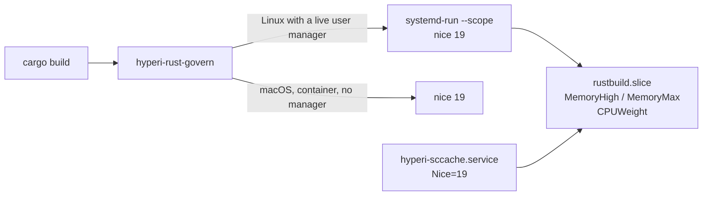

# The Rust build governor

`hyperi-rust-govern` is installed by the `developer-rust` role as
`~/.local/bin/cargo`, ahead of the real cargo on PATH, so a developer or an
agent who knows none of this runs `cargo build` and is governed. Every build
runs at nice 19, and on Linux with a live user manager it also runs inside
`rustbuild.slice`. Only `cargo` is shimmed: a bare `rustc`, or anything run
through `rustup run`, is ungoverned unless wrapped in `hyperi-rust-govern`.

## Memory is bounded, CPU is deferred

Two instruments, answering two different questions.

**Memory is bounded by the slice.** `MemoryHigh` (50% of the host's RAM)
throttles a build by reclaim, `MemoryMax` (70%) kills it, and `MemorySwapMax`
(25%) caps what it may push to swap. Percentages, so one unit fits a laptop and
a build box, and the build dies before the host does. sccache-hosted compiles
sit inside the same budget because `hyperi-sccache.service` carries
`Slice=rustbuild.slice`.

**CPU is not bounded at all -- it is deferred.** Nothing withholds cores and
nothing sets a job count: cargo's own default is already every core. A build
takes the whole machine while nobody else wants it, and drops to about a
quarter of it the moment the desktop does. Rationing CPU -- a reserve, a
computed `-j` -- is paid on an idle machine as well as a busy one, and buys
nothing that yielding does not buy at the moment it is needed. The semaphore
this replaced did exactly that: on a 32-core box it withheld two cores and
divided the rest between the eight builds it would admit, so every build ran
at `-j3`.

## Which instrument makes a build yield

| host | what defers the build | what bounds memory |
|---|---|---|
| Linux, cpu controller delegated to the user manager | `CPUWeight=30` on the slice, against the desktop's `app.slice` | the slice |
| Linux, cpu controller not delegated | nice 19, against everything in the same cpu cgroup -- the desktop included | the slice |
| Linux with no live user manager (container, stale bus socket, degraded session) | nice 19, within the build's own cpu cgroup | nothing |
| macOS | nice 19 | nothing |

`CPUWeight`, not nice, is the Linux instrument. In cgroup v2 the CPU split
between sibling cgroups is decided by `cpu.weight`, and a task's nice value
only orders threads inside its own cgroup. The slice is a direct child of the
user manager, so its siblings are `app.slice` and `session.slice` -- the
desktop -- and 30 against their 100 is the split under contention. The name
has no dash on purpose: systemd reads `-` as a hierarchy separator, so a
`rust-build.slice` would sit alone under an auto-created `rust.slice` whose
default weight of 100 is what would actually face the desktop.

What the weight does not reach is another login session. An ssh login is a
`session-N.scope` beside the whole user manager, not inside it, so a build and
a second ssh session split the CPU evenly whatever the slice says. A weight on
`user@UID.service` itself would change that, and that is a system unit, not
this role's.

nice is what remains where the weight cannot apply -- no cpu controller
delegated, no live user manager, macOS. It orders the build against everything
sharing the build's own cpu cgroup and reaches nothing outside it. With the cpu
controller not delegated into the user manager, the build and the desktop's
processes are in that same cgroup, and nice 19 is what defers one to the other.
A desktop app in another login session is still untouched by it -- the same
boundary that stops `CPUWeight`.

## What it does not do

**It does not queue builds.** Several builds started at once all run, at every
core, and share the slice's memory budget. On a small-RAM host that can mean one
is killed at `MemoryMax` instead of waiting its turn -- a failed build, retried,
rather than a failed host. Nothing queues them, and nothing ever did so
reliably: the slot count was shared state two sessions could compute
differently.

**It does not touch disk priority.** `ionice` was considered and dropped: the
idle class only binds under BFQ, and NVMe hosts run `none` or `mq-deadline`,
where it does nothing.

**It does not cap test threads.** libtest defaults `RUST_TEST_THREADS` to the
visible CPU count, which is now also what the build itself uses.

## Bypass and tuning

    HYPERI_RUST_GOVERNOR=off cargo build     # bypass one invocation
    hyperi-rust-govern <command> [args...]   # govern any other command

The bypass covers cargo's own process tree. Compiles that sccache hosts run
inside `hyperi-sccache.service`, which keeps its slice and its nice whatever
the caller set. A service started with `cargo run` keeps the nice and the
memory bound for its whole life, so bypass that one.

`-e rust_governor_enabled=false` removes the lot -- shim, slice and config --
rather than merely stopping it. To see what a host actually got:

    systemctl --user show rustbuild.slice -p CPUWeight -p MemoryHigh -p MemoryMax

The role writes `~/.config/hyperi/rust-governor.conf`, which the shim sources
first. The value in it is written as `${VAR:-default}` on purpose, so an
export in the shell beats the deployed file for one invocation and the shim can
be tested against a real config. Nothing per-machine is needed: the memory
percentages resolve against the host's own RAM, and there is no core count to
tune.

Five role variables went with the rationing: `rust_governor_slots`,
`rust_governor_cpu_reserve_cores`, `rust_governor_build_allowance_gb`,
`rust_governor_lock_wait_seconds` and `rust_governor_macos_qos`
(`rust_governor_serialize` before them). A host that still sets one fails the
converge rather than having it ignored: a host asking for one build at a time
would otherwise silently get as many as it starts. Delete the setting.

## What it needs

**Enough RAM for the biggest crate.** `MemoryMax` is 70% of the host's RAM, so
a 16 GB laptop gives the whole slice 11.2 GB -- and one `rustc` on a large
crate has been measured at 11.6 GB. That build is killed, and cargo reports the
rustc process dying on signal 9 rather than an out-of-memory error. The levers
are bypassing the governor for that one build, or building it on a box with
more RAM.

**Swap.** `MemoryHigh` throttles by reclaim, and on a swapless host the only
reclaimable memory is page cache -- so a build past the line stalls rather than
slows. The `zram_swap` role is the other half, and a converge onto a swapless
host says so in its warnings.

**Incremental compilation left alone, by default.** sccache refuses to cache
any `rustc` call carrying `-C incremental`, so `rust_governor_no_incremental`
can turn incremental off to make builds cacheable -- but the win is narrower
than it looks. Cargo never builds *dependencies* incrementally, so those were
always cacheable; what this buys is caching of *workspace* crates, and it pays
by losing incremental on those same crates. Edit a large single-`rustc` crate
and sccache misses on the changed source with nothing to fall back on.

Turn it on for a build box, a CI runner, or a workstation running many sessions
against the same workspaces, where builds start from clean trees and there is no
incremental state to lose. `HYPERI_RUST_GOVERN_NO_INCREMENTAL=1` turns it on for
one invocation where the role left it off, and `=0` opts out where the role
turned it on. Neither is `CARGO_INCREMENTAL=1`, which makes sccache refuse the
build outright.
